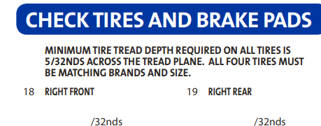
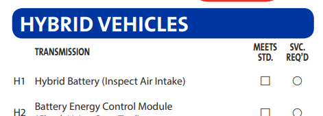

One aspect of Infrastructure testing is to ensure that systems and services meet a ***standard***.  That standard
may be yours, your company's, or one published by a government, group or organization.  When it comes to
cybersecurity, there are several standards but (in my experience) the two major standards organizations are:

- National Institute of Standards and Technology (NIST)
- Center for Internet Security (CIS)

## Terminology

Before I get into the specifics of these two standards, I want to take a minute to define some terms.


:(far fa-exclamation): These are *my* definitions, unless explicitly stated otherwise.


- **Test** : A measurement of a configuration item or process.
- **Control** : A specific action (countermeasure) taken on a configuration item or process.
- **Profile** : A categorization of `Controls` that achieve a prescribed level of acceptance.
- **Grouping** : A logical collection of related `Controls`
- **Checklist** : A collection of `Controls`, logically grouped by the user, group or organization.
- **Benchmark** : A specialization of `Checklist`, defines an established collection of controls in order to meet a "measurement milestone".

To make that a little more clear, I'll try to relate it to something different....




Let's say I want to buy a car from a used-car lot.  I want to ensure the car is going to last and is in good
working order, but I'm far from an expert in automotive maintenance.  So, I head to the internet and search for
"Chevrolet pre-owned car".  After a couple of clicks, I find a [172-Point Checklist](https://www.chevrolet.com/content/dam/chevrolet/na/us/english/index/shopping-tools/certified-pre-owned/02-pdf/gmc1-12-02414checklist-fixed-v2-10-28-16.pdf)


Ok, now that I have the `Checklist`, I can see that one of the `Groupings` is "Check Tires and Brake Pads", there
is a minimum tire depth `Control`.  To validate the `Control`, I would measure (that is `Test`) the tire tread depth
of each tire, if they are >= 5/32nds they pass the `Test`, and if all four pass, then they pass the `Control`.




Notice the "Hybrid Vehicles" section at the end?  If the car I wanted to buy was a hybrid, then I would use
the "Hybrid Vehicles" `Profile` which would change which `Controls` applied to this car from this `Checklist`.




The process continues through each of the `Groupings` until I complete the `Checklist`.  If all of the tests pass, I
can say that this meets the `Benchmark` of "Chevrolet certified pre-owned vehicle".



### Test

In relation to Infrastructure testing, a `Test` is the atomic unit.  It is a _comparison_ between an _expected_ value
and the _actual_ value.  In the following example:

``` powershell
(Get-ADDefaultDomainPasswordPolicy | Select-Object 'PasswordHistoryLength' -ExpandProperty 'PasswordHistoryLength') -ge 5
```

The expected value is **5**, the comparison is **greater-than or equal to (-ge)** and the actual value is what is
returned from querying AD, and the result is a boolean value.

In programming, these types of tests are also called "assertions", so in english this could be expressed like:

> Assert that the Password History Length is greater-than or equal to 5


### Control

A `Control` is something that can be measured and marked as "Pass" or "Fail", and has associated "metadata".  For
example:

Example
> Id: 5.2
> Title: "Use Unique Passwords"
> Function: Protect
> Description: "Use unique passwords for all enterprise assets. Best practice ..."


### Grouping

A logical collection of related `Controls` to aid in categorizing and organization.

### Profile


Example
> Id: L1
> Name: Level 1
> Title: "Corporate/Enterprise Environment"

### Checklist

### Benchmark


> Id: 1.1.1
>
> Title: "Ensure 'Enforce password history' is set to '24 or more passwords'"
>
> Description: "This policy setting determines....."
>
> Rationale: "The longer a user uses the same password, the greater....."
>
> Impact: High
>
> Profile: L1
>
> Controls: 5.2
